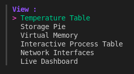
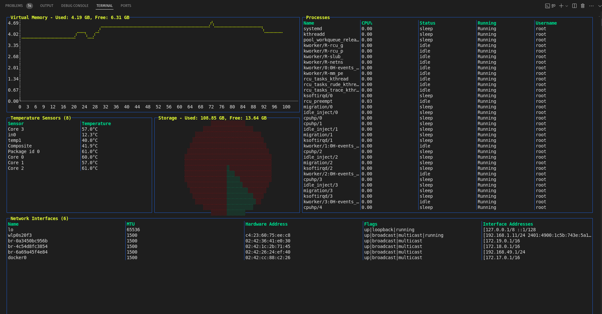
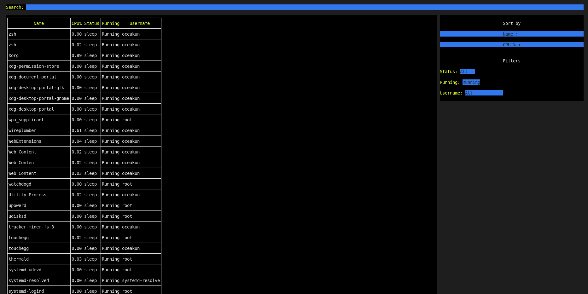

# dcm

This is a terminal-based system monitoring tool developed using the termui and tview libraries, majorly. 
It provides real-time visualizations of following system metrics: 
- CPU usage
- Memory usage
- Core temperatures 
- Network interfaces.

## System requirements
The tool will need latest versions of following in order to run successfully
- Go
- gopsutil

## Usage
1. Run the binary with the command `dcm`.
2. Choose any option from the components list. 

    

## Special features
1. Live dashboard
    
2. Interactive Process Table 
    

## License

This project is licensed under the MIT License. See the LICENSE file for details.
