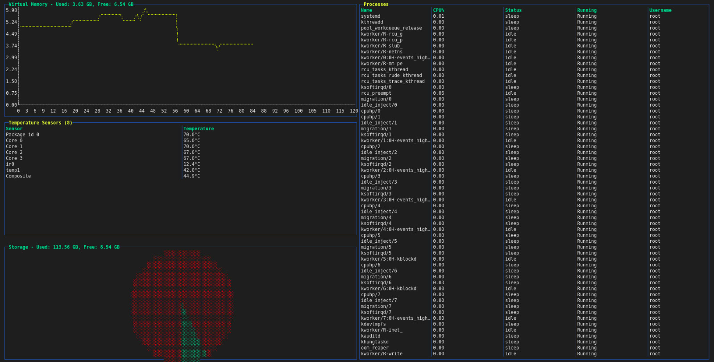

# dcm

This is a terminal-based system monitoring tool developed using the termui library. 
It provides real-time visualizations of various system metrics, including CPU usage, memory usage, storage, and more.

## License

This project is licensed under the MIT License. See the LICENSE file for details.

